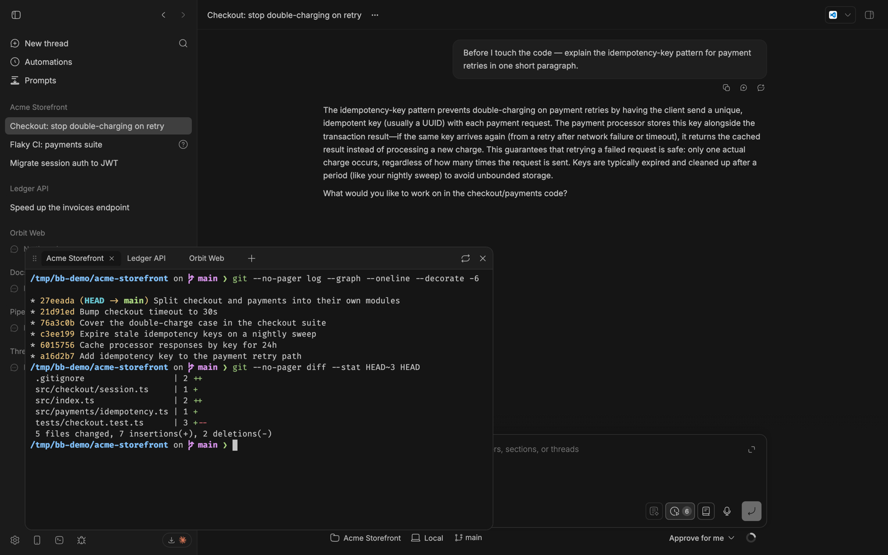
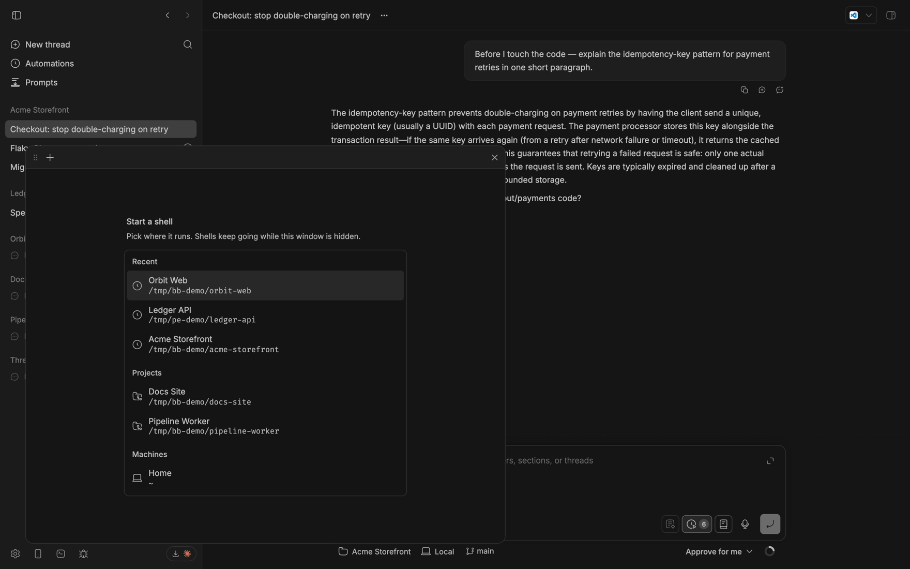
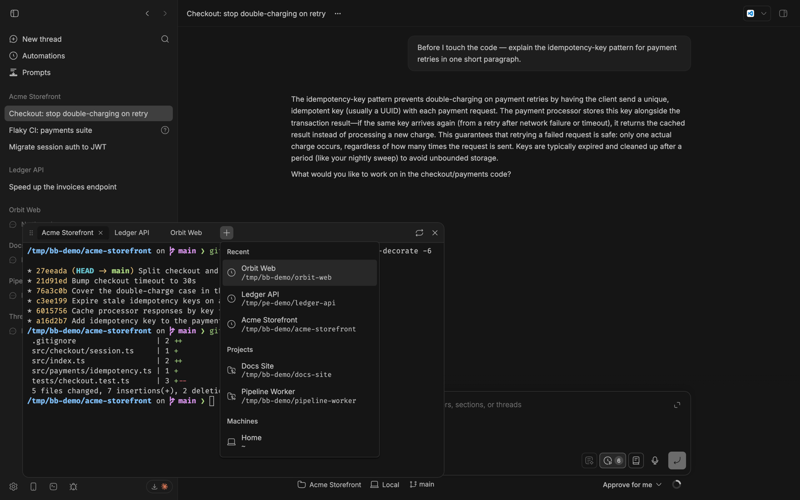
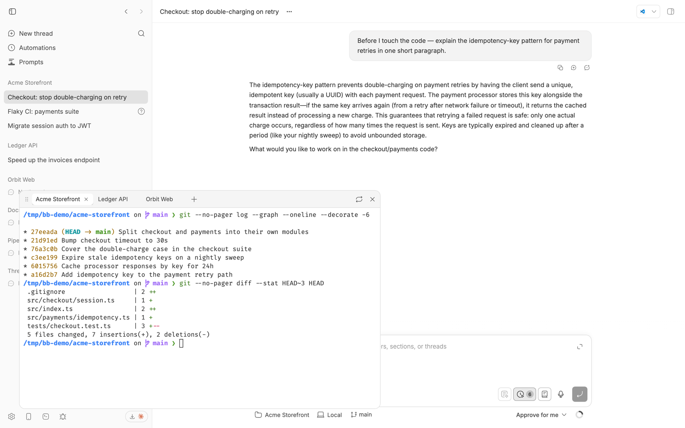

# Floating Terminal

A real terminal that floats over bb. Open it from the sidebar footer or with
`Ctrl+\``, run whatever you need next to the agent that is working, and hide it
again — the shells keep running.



*One window, several shells, sitting over the thread you are reading.*

## Install

```sh
bb plugin install git:https://github.com/vburojevic/bb-plugin-floating-terminal
```

Requires bb >= 0.35. No keys, no setup — the button appears in the sidebar
footer next to Settings the moment it lands.

## What it does

- **Tabs, one shell each.** Every tab is a real PTY on a real machine, not a
  log view. `+` opens another one in any project checkout or any machine's home
  directory.
- **Multi-machine.** Every connected bb machine is offered, so a tab can be a
  shell on a remote box. Paths are qualified as `host:path` once you have more
  than one machine, and an offline machine says so instead of failing on click.
- **It survives everything short of a reboot.** Open tabs are persisted, so
  closing the window, reloading the app, or restarting bb reattaches to the
  same shells with their scrollback intact. A shell that died while you were
  away is dropped rather than left as a dead row.
- **Drag it anywhere, resize from any edge.** The position is remembered. It
  rests in the bottom-left corner with the same inset on every edge, which is
  also the origin the open animation grows from, so it reads as coming out of
  the button that opened it.
- **Restart in place.** The restart button kills a tab's shell and starts a
  fresh one in the same directory, keeping the tab where it is.
- **The same terminal bb runs.** WebGL rendering, Unicode 11 widths, clickable
  links, bb's Nerd Font stack, 10 000 lines of scrollback — so a powerline
  prompt, a box-drawing TUI, and an emoji all land the same way they do in bb's
  own terminal panel.

### It asks where, not what



*With no shell running, the window offers directories rather than a blank pane.*

The order is the design. A flat dump of every project and machine is a filing
cabinet; putting the directories you actually opened at the top makes the list
answer "where do you want to work". Once there are enough directories to stop
being scannable, the list grows a search field.



*The `+` menu renders the same picker, so the vocabulary never shifts.*

### On a phone it stops being a window

Below bb's compact-viewport breakpoint the window becomes a sheet: it fills the
viewport minus one even inset — measured from the safe area, so it clears a
notch and a home indicator — over a blurred backdrop, and drag and resize are
not installed at all. A 760x460 window you drag around a phone screen is a
desktop idea in the wrong clothes; at that width it either covers everything
anyway or is too small to read, and the drag handle only fights the scroll
gesture. Tapping the backdrop hides it, the same as the close button.

**It gets out of the keyboard's way.** Opening the software keyboard does not
change the layout viewport on iOS, so a fixed element keeps its full height and
the prompt ends up behind the keys. The sheet takes its height and offset from
`visualViewport` instead, so it shrinks to whatever is still visible and the
prompt stays where you can see it.

**And it brings the keys a phone does not have.** A row of them sits at the
bottom of the sheet — which is exactly where the keyboard pushes it, so it lands
directly above the keys:

`esc` `tab` `ctrl` `←` `↑` `↓` `→` `^C` `^D` `^Z` `home` `end` `|` `~` `/` `-`
`_` `paste`, and one to dismiss the keyboard.

Ctrl is a latch, not a chord — you cannot hold two keys on a touch screen — so
tapping it arms the modifier and the next character you type becomes its control
code. Arrows ask the terminal whether it is in application-cursor mode, so they
work in `vim` and `less` as well as at the prompt. Tapping a key does not steal
focus, so the keyboard stays up while you use the bar.

**And you can scroll it with a finger**, which xterm itself cannot do: xterm 6
moved its viewport onto a scrollable widget that only listens for wheel events,
so on a touch screen the scrollbar renders and dragging does nothing. Dragging
here scrolls the scrollback and keeps a little momentum after you let go. In the
alternate screen — `vim`, `less`, `tmux` — there is no scrollback to move
through, so a drag sends cursor keys instead, the same substitution xterm makes
for a wheel there.

### It looks like the rest of your bb



*The xterm palette is derived from bb's live theme tokens, light or dark.*

Background, foreground, cursor and selection come from the window's own card
tokens; the ANSI 16 come from `--ansi-0` … `--ansi-15`, the same tokens bb's
terminal reads. Switch bb to Dracula or Gruvbox and this window's reds and
yellows move with it, instead of sitting on a palette of their own.

**Icons render everywhere.** A shell that prints file icons — `eza --icons`, a
powerline prompt — needs a Nerd Font, and on a desktop that works only because
the OS has one installed to fall back to. A phone has none and bb ships none, so
every icon came out as a tofu box. The plugin now carries the Nerd Font symbol
set itself (`fonts/`), listed last in the stack and restricted by
`unicode-range`, so an installed Nerd Font still wins and this only draws the
codepoints nothing else can.

A tab is named for the directory it runs in, and takes the shell's title when
the shell sets one worth having — `npm run dev` while that is running, back to
`Acme Storefront` at the prompt. Titles that only restate the location
(`user@host:~/Git/acme`, `acme-storefront:main`) are ignored, because the tab
already says that; the directory stays in the tooltip either way. The rename
lands on the bb session itself, so `bb terminal list` shows the same name.

## Settings

**bb → Extensions → Floating Terminal**: font size, and whether `` Ctrl+` ``
toggles the window.

## How it fits together

```
app.tsx                       contentScript (React root) + sidebarFooterAction
├── lib/controller.ts         external store: who opened/closed the window
└── components/
    ├── floating-terminal.tsx the window — geometry, server sync, layout
    ├── shell-picker.tsx      the directory list, shared by both entry points
    ├── tab-bar.tsx           the tab strip
    └── terminal-view.tsx     one tab's terminal; owns a TerminalPump

server.ts                     RPC over bb.sdk.terminals; tab list in kv
lib/pump.ts                   one xterm <-> one PTY
lib/tabs.ts                   pure reducer for the tab strip
lib/terminal-io.ts            input chunking, shell-title filtering
lib/keys.ts                   the on-screen key bar's sequences
lib/scroll.ts                 finger travel -> whole terminal lines
lib/viewport.ts               visualViewport -> sheet height, keyboard state
lib/scopes.ts                 which directories are offered, and in what order
lib/frame.ts                  drag, resize, clamping, persistence
lib/theme.ts                  bb's oklch tokens -> an xterm palette
lib/rpc.ts                    fetch twin of the useRpc hook
fonts/nerd-symbols.css        generated: the Nerd Font symbol set, inlined
```

Three things are worth knowing before changing it:

**There is no bb React context.** A content script mounts the root into
`document.body`, outside bb's component tree, so `useRpc`, `useSettings`, and
`useBbContext` are unavailable. `lib/rpc.ts` speaks the plugin RPC wire format
(`POST /api/v1/plugins/<id>/rpc/<method>`) directly and is typed off the same
`rpcContract`.

**Output is polled, not streamed.** bb exposes terminal output to plugins as a
sequence-numbered buffer, so `lib/pump.ts` polls: 40 ms while bytes are moving,
backing off to 320 ms when the shell is quiet, and stopping entirely for tabs
that are not visible. A hidden tab costs nothing and is caught up on return.

**The server owns the tab list; the client owns status and focus.** Every
response carrying tab state is a `{ revision, tabs, activeTabId }` snapshot, and
the reducer applies one only if its revision is strictly newer than the last.
That is what makes overlapping requests safe: a slow `init` that started before
an `openTab` committed carries an older revision and simply loses, so it can
neither drop the new tab nor resurrect a closed one. Re-syncing on every window
open is also what evicts a tab whose shell died while you were away.

Server-side, every mutation runs inside `serialize`. Each is a read-modify-write
over one kv array with awaits in the middle (`listScopes`, `close`, `create`),
so without the mutex two overlapping calls would read the same snapshot and the
last writer would silently drop the other's session — leaking a live PTY that
appears in no list and can never be closed. This is invisible on localhost,
where a round trip is ~2 ms, and easy to hit on a remote machine at ~100 ms.

## Development

```sh
npm install
npm run typecheck
npm test
bb plugin build
bb plugin dev      # watch: rebuild + reload on every save
```

`npm test` is hermetic. The mobile behaviour is not testable that way — a sheet
that tracks `visualViewport`, a key bar, and touch scrolling only mean anything
against a real browser and a real pty — so that lives in a separate pass:

```sh
npm run test:mobile                            # the whole matrix
node tests/mobile-e2e.mjs webkit "iPhone 14 Pro"
```

It drives a running bb (`BB_APP_URL`, default `http://localhost:38886`) across
Galaxy S9+, iPhone 14 Pro, Pixel 7, the same iPhone under WebKit — the engine
iOS Safari uses — and an iPad, which is over the compact breakpoint and must
stay a window. 34 checks: layout and insets, stacking above bb's chrome, the
directory list, the key bar and its latch, touch scrolling in both buffers,
momentum, the bundled glyphs, keyboard-aware height, and persistence across a
hide and reopen.

It opens and closes real shells in whichever bb it points at, and asserts it
leaves none behind. Touch gestures go over CDP, so on WebKit those checks report
SKIP rather than passing silently.

`components/ui/` is vendored source you own (the shadcn model) — edit it
freely, it never updates out from under you. Add more from bb's registry, which
is pinned in `components.json` to the bb release you are running:

```sh
npx shadcn add @bb/table @bb/command
```

React, `react-dom/client`, the radix portal primitives, and `sonner` are
provided by the bb app at runtime and never bundled; everything else (xterm,
hugeicons, tailwind-merge) bundles from `node_modules`. Ship `dist/` so
consumers never need npm.

## License

[MIT](LICENSE).

`fonts/nerd-symbols.css` carries Symbols Nerd Font Mono from
[Nerd Fonts](https://github.com/ryanoasis/nerd-fonts) (MIT — see
`fonts/LICENSE-nerd-fonts`), which aggregates icon sets under their own upstream
licences. See `fonts/README.md` for provenance and how to rebuild it.
